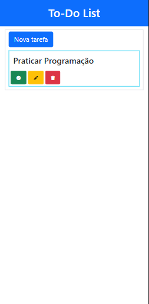

# To-Do-List

## Lista de Tarefas com CRUD e usando o localStorage.

 

## Sumário

- [Sobre](#Sobre)
- [Como Usar](#Como-usar)
    * [Cadastrando uma Tarefa](#Cadastrando-uma-tarefa)
    * [Concluindo uma Tarefa](#Concluindo-uma-tarefa)
    * [Excluindo uma Tarefa](#Excluindo-uma-tarefa)
    * [Editando uma Tarefa](#Editando-uma-tarefa)

## Sobre

Projeto de Lista de Tarefas dinâmica e funcional que usa o localStorage para armazenar as tarefas cadastradas.

#### Desktop 

#### Mobile 

## Como Usar

### Cadastrando uma Tarefa

Para cadastrar uma nova tarefa, clique em Nova Tarefa.

#### Desktop 

#### Mobile 

Depois é só clicar no botão azul do lado direito o apertar Enter para cadastrar a tarefa.

#### Desktop 

#### Mobile 

### Concluindo uma Tarefa

Para dar uma tarefa como concluída, clique no botão verde e na janela de confirmação, clique em OK.

#### Desktop 

### Excluindo uma Tarefa

Para excluir uma tarefa, clique no botão vermelho e na janela de confirmação, clique em OK.

#### Desktop 

### Editando uma Tarefa

Para editar uma tarefa, clique no botão amarelo e aparecerá o campo de edição logo abaixo.

#### Desktop 

#### Mobile 

Digite o novo nome e clique no botão verde para confirmar ou no botão vermelho para cancelar a edição

#### Desktop 

#### Mobile 
